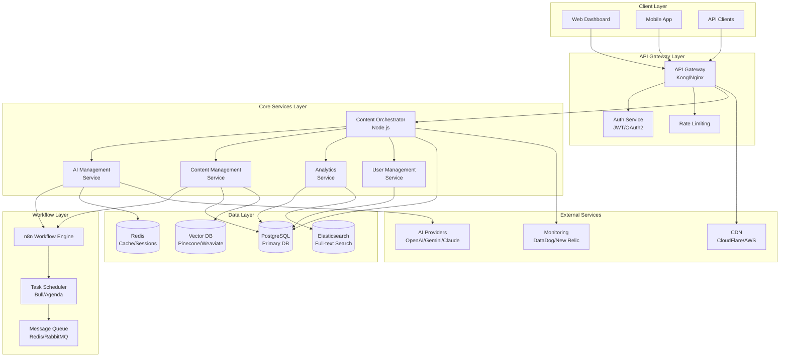

# Enterprise Allixios Platform Architecture Design

## Overview

This design document outlines the transformation of Allixios from a database-first content management platform into a world-class, enterprise-grade system capable of handling millions of articles, thousands of concurrent users, and generating significant revenue through intelligent automation and AI-powered content operations.

The architecture leverages a hybrid approach combining the performance benefits of Node.js microservices with the visual workflow management capabilities of n8n, all built on a robust PostgreSQL foundation with advanced AI integration and enterprise security features.

## Architecture

### System Architecture Overview



### Microservices Architecture

#### 1. Content Orchestrator Service (Node.js)
**Purpose:** Central coordination and intelligent decision-making
- **Technology:** Node.js with TypeScript, Express.js
- **Responsibilities:**
  - Workflow orchestration and scheduling
  - Resource management and throttling
  - Priority queue management
  - State machine control
  - Performance monitoring
- **Scaling:** Horizontal with load balancer
- **Database:** Direct PostgreSQL connections with connection pooling

#### 2. AI Management Service (Node.js)
**Purpose:** AI model management and optimization
- **Technology:** Node.js with TypeScript, ML libraries
- **Responsibilities:**
  - AI model selection and routing
  - Cost optimization and budget management
  - Quality scoring and validation
  - Provider failover and load balancing
  - Fine-tuning and model improvement
- **Scaling:** Auto-scaling based on AI workload
- **Integration:** Multiple AI provider APIs with circuit breakers

#### 3. Content Management Service (Node.js)
**Purpose:** Content lifecycle and operations
- **Technology:** Node.js with TypeScript, GraphQL
- **Responsibilities:**
  - Content CRUD operations
  - Version control and collaboration
  - SEO optimization and analysis
  - Media management and processing
  - Translation and localization
- **Scaling:** Horizontal with read replicas
- **Storage:** PostgreSQL + Vector DB for semantic search

#### 4. Analytics Service (Node.js)
**Purpose:** Real-time analytics and business intelligence
- **Technology:** Node.js with TypeScript, ClickHouse/TimescaleDB
- **Responsibilities:**
  - Real-time event processing
  - Performance metrics calculation
  - Predictive analytics and ML
  - Dashboard data aggregation
  - Alerting and notifications
- **Scaling:** Stream processing with Kafka/Redis Streams
- **Storage:** Time-series database for metrics

#### 5. User Management Service (Node.js)
**Purpose:** Authentication, authorization, and user operations
- **Technology:** Node.js with TypeScript, Passport.js
- **Responsibilities:**
  - User authentication and authorization
  - Multi-tenant data isolation
  - Role-based access control
  - SSO integration
  - Audit logging
- **Scaling:** Stateless with JWT tokens
- **Storage:** PostgreSQL with encrypted PII

### Workflow Engine Integration (n8n)

#### Workflow Categories
1. **Content Generation Workflows**
   - Topic research and validation
   - AI content generation with multiple models
   - Quality assurance and optimization
   - SEO analysis and enhancement
   - Publishing and distribution

2. **Analytics Workflows**
   - Performance data collection
   - SEO monitoring and reporting
   - User behavior analysis
   - Revenue tracking and optimization
   - Competitive analysis

3. **Maintenance Workflows**
   - Content updates and refreshes
   - Link validation and fixing
   - Image optimization and CDN sync
   - Database maintenance and cleanup
   - Security scans and updates

#### n8n Integration Pattern
```typescript
// Node.js Orchestrator → n8n Workflow Dispatch
class WorkflowDispatcher {
  async dispatchContentGeneration(batch: ContentBatch): Promise<string> {
    const workflowId = await this.selectOptimalWorkflow(batch);
    
    const execution = await this.n8nClient.executeWorkflow(workflowId, {
      batch_id: batch.id,
      topics: batch.topics,
      priority: batch.priority,
      constraints: batch.constraints,
      callback_url: `${this.baseUrl}/api/workflows/callback`
    });
    
    await this.trackExecution(execution.id, batch.id);
    return execution.id;
  }
}
```

## Components and Interfaces

### Core Service Interfaces

#### Content Orchestrator API
```typescript
interface ContentOrchestrator {
  // Workflow Management
  scheduleContentGeneration(request: ContentRequest): Promise<ExecutionPlan>;
  getExecutionStatus(executionId: string): Promise<ExecutionStatus>;
  cancelExecution(executionId: string): Promise<boolean>;
  
  // Resource Management
  checkResourceAvailability(): Promise<ResourceStatus>;
  allocateResources(requirements: ResourceRequirements): Promise<ResourceAllocation>;
  releaseResources(allocationId: string): Promise<void>;
  
  // Performance Monitoring
  getSystemHealth(): Promise<SystemHealth>;
  getPerformanceMetrics(timeRange: TimeRange): Promise<PerformanceMetrics>;
  getExecutionAnalytics(filters: AnalyticsFilters): Promise<ExecutionAnalytics>;
}

interface ContentRequest {
  topics: Topic[];
  priority: Priority;
  constraints: ExecutionConstraints;
  callback?: CallbackConfig;
}

interface ExecutionPlan {
  id: string;
  estimatedDuration: number;
  estimatedCost: number;
  scheduledTime: Date;
  workflowAssignments: WorkflowAssignment[];
}
```

#### AI Management API
```typescript
interface AIManagementService {
  // Model Management
  selectOptimalModel(request: ContentGenerationRequest): Promise<AIModelSelection>;
  generateContent(request: ContentGenerationRequest): Promise<GeneratedContent>;
  validateContentQuality(content: string, criteria: QualityCriteria): Promise<QualityScore>;
  
  // Cost Management
  estimateCost(request: ContentGenerationRequest): Promise<CostEstimate>;
  trackUsage(modelId: string, tokens: number, cost: number): Promise<void>;
  getBudgetStatus(): Promise<BudgetStatus>;
  
  // Provider Management
  getProviderStatus(): Promise<ProviderStatus[]>;
  switchProvider(fromProvider: string, toProvider: string): Promise<void>;
  configureFailover(config: FailoverConfig): Promise<void>;
}

interface AIModelSelection {
  modelId: string;
  provider: string;
  estimatedCost: number;
  estimatedQuality: number;
  reasoning: string;
}
```

#### Content Management API
```typescript
interface ContentManagementService {
  // Content Operations
  createArticle(data: ArticleCreateRequest): Promise<Article>;
  updateArticle(id: string, data: ArticleUpdateRequest): Promise<Article>;
  getArticle(id: string, options?: GetArticleOptions): Promise<Article>;
  searchArticles(query: SearchQuery): Promise<SearchResults>;
  
  // Version Control
  createVersion(articleId: string, changes: ContentChanges): Promise<Version>;
  getVersionHistory(articleId: string): Promise<Version[]>;
  revertToVersion(articleId: string, versionId: string): Promise<Article>;
  
  // Collaboration
  lockForEditing(articleId: string, userId: string): Promise<EditLock>;
  releaseEditLock(lockId: string): Promise<void>;
  getCollaborators(articleId: string): Promise<Collaborator[]>;
  
  // SEO & Optimization
  analyzeSEO(articleId: string): Promise<SEOAnalysis>;
  optimizeContent(articleId: string, criteria: OptimizationCriteria): Promise<OptimizationSuggestions>;
  generateMetadata(articleId: string): Promise<ArticleMetadata>;
}
```

### Database Schema Evolution

#### Enhanced Core Tables
```sql
-- Enhanced articles table with enterprise features
CREATE TABLE articles (
    id uuid PRIMARY KEY DEFAULT gen_random_uuid(),
    title text NOT NULL,
    content text,
    slug text UNIQUE NOT NULL,
    
    -- Hierarchical organization
    niche_id uuid REFERENCES niches(id),
    category_id uuid REFERENCES categories(id),
    author_id uuid REFERENCES authors(id),
    
    -- Content metadata
    meta_title text,
    meta_description text,
    featured_image_url text,
    excerpt text,
    
    -- Status and workflow
    status content_status DEFAULT 'draft',
    workflow_state jsonb DEFAULT '{}',
    
    -- Performance metrics
    content_quality_score integer DEFAULT 0,
    seo_score integer DEFAULT 0,
    engagement_score decimal DEFAULT 0,
    
    -- Analytics
    view_count integer DEFAULT 0,
    unique_views integer DEFAULT 0,
    time_on_page integer DEFAULT 0,
    bounce_rate decimal DEFAULT 0,
    social_shares integer DEFAULT 0,
    
    -- AI and optimization
    ai_generated boolean DEFAULT false,
    ai_model_used text,
    generation_cost decimal DEFAULT 0,
    optimization_suggestions jsonb DEFAULT '[]',
    
    -- Versioning
    version_number integer DEFAULT 1,
    parent_version_id uuid REFERENCES articles(id),
    
    -- Multi-tenant support
    tenant_id uuid REFERENCES tenants(id),
    
    -- Vector search
    content_embedding vector(1536),
    
    -- Audit fields
    created_at timestamptz DEFAULT now(),
    updated_at timestamptz DEFAULT now(),
    created_by uuid REFERENCES users(id),
    updated_by uuid REFERENCES users(id),
    
    -- Soft delete
    deleted_at timestamptz,
    
    -- Full-text search
    search_vector tsvector GENERATED ALWAYS AS (
        setweight(to_tsvector('english', coalesce(title, '')), 'A') ||
        setweight(to_tsvector('english', coalesce(excerpt, '')), 'B') ||
        setweight(to_tsvector('english', coalesce(content, '')), 'C')
    ) STORED
);

-- Multi-tenant support
CREATE TABLE tenants (
    id uuid PRIMARY KEY DEFAULT gen_random_uuid(),
    name text NOT NULL,
    slug text UNIQUE NOT NULL,
    
    -- Branding
    logo_url text,
    primary_color text,
    secondary_color text,
    custom_domain text,
    
    -- Configuration
    settings jsonb DEFAULT '{}',
    feature_flags jsonb DEFAULT '{}',
    limits jsonb DEFAULT '{}',
    
    -- Billing
    plan_type text DEFAULT 'free',
    billing_email text,
    subscription_status text DEFAULT 'active',
    
    -- Audit
    created_at timestamptz DEFAULT now(),
    updated_at timestamptz DEFAULT now(),
    
    -- Soft delete
    deleted_at timestamptz
);

-- Workflow execution tracking
CREATE TABLE workflow_executions (
    id uuid PRIMARY KEY DEFAULT gen_random_uuid(),
    tenant_id uuid REFERENCES tenants(id),
    
    -- Execution metadata
    workflow_type text NOT NULL,
    workflow_id text NOT NULL,
    execution_id text UNIQUE NOT NULL,
    
    -- Status tracking
    status execution_status DEFAULT 'queued',
    progress_percentage integer DEFAULT 0,
    
    -- Input/Output
    input_data jsonb,
    output_data jsonb,
    error_details jsonb,
    
    -- Performance
    started_at timestamptz,
    completed_at timestamptz,
    duration_ms integer,
    
    -- Resource usage
    tokens_used integer DEFAULT 0,
    cost_usd decimal DEFAULT 0,
    memory_used_mb integer DEFAULT 0,
    
    -- Relationships
    parent_execution_id uuid REFERENCES workflow_executions(id),
    triggered_by uuid REFERENCES users(id),
    
    -- Audit
    created_at timestamptz DEFAULT now(),
    updated_at timestamptz DEFAULT now()
);
```

### Advanced Caching Strategy

#### Multi-Level Caching Architecture
```typescript
class CacheManager {
  private l1Cache: NodeCache; // In-memory cache
  private l2Cache: RedisCache; // Distributed cache
  private l3Cache: CDNCache; // Edge cache
  
  async get<T>(key: string, options?: CacheOptions): Promise<T | null> {
    // L1: Check in-memory cache
    let value = await this.l1Cache.get<T>(key);
    if (value) return value;
    
    // L2: Check Redis cache
    value = await this.l2Cache.get<T>(key);
    if (value) {
      await this.l1Cache.set(key, value, options?.l1TTL);
      return value;
    }
    
    // L3: Check CDN cache (for static content)
    if (options?.checkCDN) {
      value = await this.l3Cache.get<T>(key);
      if (value) {
        await this.l2Cache.set(key, value, options?.l2TTL);
        await this.l1Cache.set(key, value, options?.l1TTL);
        return value;
      }
    }
    
    return null;
  }
  
  async invalidate(pattern: string): Promise<void> {
    await Promise.all([
      this.l1Cache.invalidate(pattern),
      this.l2Cache.invalidate(pattern),
      this.l3Cache.invalidate(pattern)
    ]);
  }
}
```

## Data Models

### Core Domain Models

#### Article Domain Model
```typescript
interface Article {
  id: string;
  tenantId: string;
  
  // Content
  title: string;
  content: string;
  excerpt?: string;
  slug: string;
  
  // Metadata
  metaTitle?: string;
  metaDescription?: string;
  featuredImageUrl?: string;
  tags: string[];
  
  // Relationships
  nicheId: string;
  categoryId?: string;
  authorId: string;
  
  // Status
  status: ContentStatus;
  workflowState: WorkflowState;
  
  // Performance
  contentQualityScore: number;
  seoScore: number;
  engagementScore: number;
  
  // Analytics
  viewCount: number;
  uniqueViews: number;
  timeOnPage: number;
  bounceRate: number;
  socialShares: number;
  
  // AI
  aiGenerated: boolean;
  aiModelUsed?: string;
  generationCost: number;
  optimizationSuggestions: OptimizationSuggestion[];
  
  // Versioning
  versionNumber: number;
  parentVersionId?: string;
  
  // Vector search
  contentEmbedding?: number[];
  
  // Audit
  createdAt: Date;
  updatedAt: Date;
  createdBy: string;
  updatedBy: string;
  deletedAt?: Date;
}

interface WorkflowState {
  currentStage: string;
  completedStages: string[];
  pendingActions: string[];
  lastProcessedAt: Date;
  processingLocks: ProcessingLock[];
}

interface OptimizationSuggestion {
  type: 'seo' | 'readability' | 'engagement' | 'monetization';
  priority: 'low' | 'medium' | 'high';
  suggestion: string;
  estimatedImpact: number;
  implementationCost: number;
}
```

#### AI Model Management
```typescript
interface AIModel {
  id: string;
  name: string;
  provider: string;
  
  // Capabilities
  maxTokens: number;
  supportedLanguages: string[];
  contentTypes: string[];
  
  // Performance
  averageQualityScore: number;
  averageLatency: number;
  reliabilityScore: number;
  
  // Cost
  costPerToken: number;
  costPerRequest: number;
  
  // Configuration
  defaultParameters: Record<string, any>;
  rateLimits: RateLimit;
  
  // Status
  isActive: boolean;
  healthStatus: 'healthy' | 'degraded' | 'unavailable';
  
  // Analytics
  totalRequests: number;
  totalTokens: number;
  totalCost: number;
  
  createdAt: Date;
  updatedAt: Date;
}

interface RateLimit {
  requestsPerMinute: number;
  tokensPerMinute: number;
  requestsPerDay: number;
  tokensPerDay: number;
}
```

## Error Handling

### Comprehensive Error Management Strategy

#### Error Classification
```typescript
enum ErrorType {
  // System errors
  SYSTEM_ERROR = 'SYSTEM_ERROR',
  DATABASE_ERROR = 'DATABASE_ERROR',
  NETWORK_ERROR = 'NETWORK_ERROR',
  
  // Business logic errors
  VALIDATION_ERROR = 'VALIDATION_ERROR',
  AUTHORIZATION_ERROR = 'AUTHORIZATION_ERROR',
  RESOURCE_NOT_FOUND = 'RESOURCE_NOT_FOUND',
  
  // External service errors
  AI_PROVIDER_ERROR = 'AI_PROVIDER_ERROR',
  RATE_LIMIT_ERROR = 'RATE_LIMIT_ERROR',
  QUOTA_EXCEEDED = 'QUOTA_EXCEEDED',
  
  // Workflow errors
  WORKFLOW_TIMEOUT = 'WORKFLOW_TIMEOUT',
  WORKFLOW_FAILED = 'WORKFLOW_FAILED',
  RESOURCE_UNAVAILABLE = 'RESOURCE_UNAVAILABLE'
}

class ErrorHandler {
  async handleError(error: AppError, context: ErrorContext): Promise<ErrorResponse> {
    // Log error with context
    await this.logError(error, context);
    
    // Determine retry strategy
    const retryStrategy = this.getRetryStrategy(error.type);
    
    // Apply circuit breaker if needed
    if (this.shouldTriggerCircuitBreaker(error)) {
      await this.circuitBreaker.open(context.service);
    }
    
    // Send alerts if critical
    if (error.severity === 'critical') {
      await this.alertManager.sendAlert(error, context);
    }
    
    // Return appropriate response
    return this.formatErrorResponse(error, context);
  }
  
  private getRetryStrategy(errorType: ErrorType): RetryStrategy {
    switch (errorType) {
      case ErrorType.RATE_LIMIT_ERROR:
        return new ExponentialBackoffRetry({ maxRetries: 5, baseDelay: 1000 });
      case ErrorType.NETWORK_ERROR:
        return new LinearRetry({ maxRetries: 3, delay: 500 });
      case ErrorType.AI_PROVIDER_ERROR:
        return new ProviderFailoverRetry({ maxRetries: 2 });
      default:
        return new NoRetry();
    }
  }
}
```

#### Circuit Breaker Implementation
```typescript
class CircuitBreaker {
  private state: 'closed' | 'open' | 'half-open' = 'closed';
  private failureCount = 0;
  private lastFailureTime?: Date;
  
  async execute<T>(operation: () => Promise<T>, service: string): Promise<T> {
    if (this.state === 'open') {
      if (this.shouldAttemptReset()) {
        this.state = 'half-open';
      } else {
        throw new Error(`Circuit breaker is open for service: ${service}`);
      }
    }
    
    try {
      const result = await operation();
      this.onSuccess();
      return result;
    } catch (error) {
      this.onFailure();
      throw error;
    }
  }
  
  private onSuccess(): void {
    this.failureCount = 0;
    this.state = 'closed';
  }
  
  private onFailure(): void {
    this.failureCount++;
    this.lastFailureTime = new Date();
    
    if (this.failureCount >= this.failureThreshold) {
      this.state = 'open';
    }
  }
}
```

## Testing Strategy

### Comprehensive Testing Framework

#### Unit Testing
```typescript
// Service unit tests
describe('ContentOrchestrator', () => {
  let orchestrator: ContentOrchestrator;
  let mockAIService: jest.Mocked<AIManagementService>;
  let mockDatabase: jest.Mocked<DatabaseService>;
  
  beforeEach(() => {
    mockAIService = createMockAIService();
    mockDatabase = createMockDatabase();
    orchestrator = new ContentOrchestrator(mockAIService, mockDatabase);
  });
  
  describe('scheduleContentGeneration', () => {
    it('should create optimal execution plan', async () => {
      const request = createContentRequest();
      const plan = await orchestrator.scheduleContentGeneration(request);
      
      expect(plan.estimatedDuration).toBeLessThan(300000); // 5 minutes
      expect(plan.estimatedCost).toBeLessThan(10); // $10
      expect(plan.workflowAssignments).toHaveLength(request.topics.length);
    });
    
    it('should handle resource constraints', async () => {
      mockDatabase.checkResourceAvailability.mockResolvedValue({
        available: false,
        reason: 'API_RATE_LIMIT'
      });
      
      const request = createContentRequest();
      const plan = await orchestrator.scheduleContentGeneration(request);
      
      expect(plan.scheduledTime).toBeAfter(new Date());
    });
  });
});
```

#### Integration Testing
```typescript
// End-to-end workflow testing
describe('Content Generation Workflow', () => {
  let testEnvironment: TestEnvironment;
  
  beforeAll(async () => {
    testEnvironment = await setupTestEnvironment();
  });
  
  afterAll(async () => {
    await testEnvironment.cleanup();
  });
  
  it('should generate high-quality article from topic', async () => {
    const topic = await testEnvironment.createTestTopic();
    
    const execution = await testEnvironment.orchestrator
      .scheduleContentGeneration({
        topics: [topic],
        priority: 'high',
        constraints: { maxCost: 5, maxDuration: 180000 }
      });
    
    await testEnvironment.waitForCompletion(execution.id);
    
    const article = await testEnvironment.getGeneratedArticle(topic.id);
    
    expect(article).toBeDefined();
    expect(article.contentQualityScore).toBeGreaterThan(80);
    expect(article.content.length).toBeGreaterThan(1000);
    expect(article.seoScore).toBeGreaterThan(70);
  });
});
```

#### Performance Testing
```typescript
// Load testing with Artillery or k6
describe('Performance Tests', () => {
  it('should handle 1000 concurrent content requests', async () => {
    const requests = Array.from({ length: 1000 }, () => 
      createContentRequest()
    );
    
    const startTime = Date.now();
    const results = await Promise.allSettled(
      requests.map(req => orchestrator.scheduleContentGeneration(req))
    );
    const endTime = Date.now();
    
    const successCount = results.filter(r => r.status === 'fulfilled').length;
    const avgResponseTime = (endTime - startTime) / requests.length;
    
    expect(successCount).toBeGreaterThan(950); // 95% success rate
    expect(avgResponseTime).toBeLessThan(200); // <200ms average
  });
});
```

This comprehensive design provides the foundation for transforming Allixios into an enterprise-grade platform that can scale to handle millions of articles while maintaining high performance, reliability, and cost efficiency. The hybrid architecture leverages the best of both Node.js microservices and n8n workflow management, creating a system that is both powerful and maintainable.