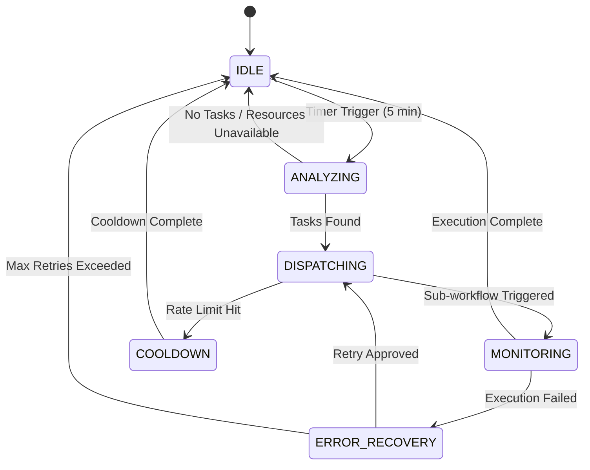

# Design Document

## Overview

This design implements a Master Orchestrator Pattern to replace the current chaotic 4-workflow architecture with a centralized, intelligent workflow management system. The design follows a hub-and-spoke model where a single Master Orchestrator makes all execution decisions based on real-time system health, resource availability, and business priorities.

The architecture eliminates resource contention, prevents API rate limit violations, provides complete execution visibility, and enables intelligent cost management while scaling to handle 500+ articles per day with enterprise-grade reliability.

## Architecture

### System Architecture Diagram

```
┌─────────────────────────────────────────────────────────┐
│           MASTER ORCHESTRATOR WORKFLOW                   │
│                  (Runs every 5 minutes)                  │
│                                                         │
│  ┌─────────────┐  ┌─────────────┐  ┌─────────────┐     │
│  │ Intelligent │  │ Priority    │  │ Resource    │     │
│  │ Scheduler   │  │ Queue Mgr   │  │ Manager     │     │
│  └─────────────┘  └─────────────┘  └─────────────┘     │
│                                                         │
│  ┌─────────────┐  ┌─────────────┐  ┌─────────────┐     │
│  │ State       │  │ Webhook     │  │ Monitoring  │     │
│  │ Machine     │  │ Controller  │  │ & Alerts    │     │
│  └─────────────┘  └─────────────┘  └─────────────┘     │
└────────────┬────────────────────────────────────────────┘
             │
     ┌───────┴───────┬───────────┬────────────┐
     ▼               ▼           ▼            ▼
SUB-WORKFLOW 1   SUB-WORKFLOW 2  SUB-WORKFLOW 3  SUB-WORKFLOW 4
Content Pipeline  SEO Monitor    Revenue Opt.    Intelligence
(Webhook Trigger) (Webhook Trigger) (Webhook Trigger) (Webhook Trigger)
     │               │           │            │
     └───────────────┴───────────┴────────────┘
                     │
                     ▼
            ┌─────────────────┐
            │ PostgreSQL DB   │
            │ Orchestration   │
            │ State & Metrics │
            └─────────────────┘
```

### Component Architecture

#### Master Orchestrator Workflow Components

1. **Intelligent Scheduler Node**
   - Evaluates current time and system state
   - Determines which sub-workflows should execute
   - Implements business logic for execution timing
   - Manages execution intervals and cooldown periods

2. **Priority Queue Manager**
   - Fetches pending tasks from database
   - Calculates priority scores: (Priority × 10) + (Age in minutes)
   - Implements fairness algorithms and starvation prevention
   - Routes tasks to appropriate sub-workflows

3. **Resource Manager**
   - Monitors API rate limits across all providers
   - Tracks database connections and memory usage
   - Enforces cost budgets and usage limits
   - Makes go/no-go decisions for workflow execution

4. **State Machine Controller**
   - Manages orchestrator states: IDLE → ANALYZING → DISPATCHING → MONITORING → ERROR_RECOVERY
   - Tracks execution context and dependencies
   - Handles state transitions and timeout management
   - Implements error recovery and retry logic

5. **Webhook Controller**
   - Manages webhook-based communication with sub-workflows
   - Handles authentication and payload formatting
   - Implements timeout and retry mechanisms
   - Processes callback responses and updates state

6. **Monitoring & Alerts**
   - Collects real-time performance metrics
   - Detects anomalies and threshold violations
   - Sends intelligent alerts and notifications
   - Provides executive dashboard data

## Components and Interfaces

### Database Schema Design

```sql
-- Core orchestration tracking table
CREATE TABLE workflow_orchestration (
    execution_id UUID PRIMARY KEY DEFAULT gen_random_uuid(),
    workflow_type TEXT NOT NULL CHECK (workflow_type IN ('content_pipeline', 'seo_monitor', 'revenue_optimizer', 'intelligence_engine')),
    status TEXT NOT NULL CHECK (status IN ('queued', 'analyzing', 'dispatching', 'running', 'completed', 'failed', 'retrying')),
    priority INTEGER NOT NULL DEFAULT 50 CHECK (priority >= 0 AND priority <= 100),
    
    -- Timing fields
    scheduled_at TIMESTAMPTZ NOT NULL,
    started_at TIMESTAMPTZ,
    completed_at TIMESTAMPTZ,
    timeout_at TIMESTAMPTZ,
    
    -- Execution context
    context JSONB NOT NULL DEFAULT '{}',
    input_data JSONB,
    result_data JSONB,
    error_data JSONB,
    
    -- Relationship tracking
    parent_execution_id UUID REFERENCES workflow_orchestration(execution_id),
    batch_id UUID,
    
    -- Retry and recovery
    retry_count INTEGER DEFAULT 0,
    max_retries INTEGER DEFAULT 3,
    next_retry_at TIMESTAMPTZ,
    
    -- Metrics
    duration_ms INTEGER,
    cost_usd DECIMAL(10,4),
    items_processed INTEGER,
    
    -- Audit
    created_at TIMESTAMPTZ DEFAULT NOW(),
    updated_at TIMESTAMPTZ DEFAULT NOW()
);

-- Resource usage tracking
CREATE TABLE workflow_resource_usage (
    id UUID PRIMARY KEY DEFAULT gen_random_uuid(),
    execution_id UUID NOT NULL REFERENCES workflow_orchestration(execution_id),
    resource_type TEXT NOT NULL, -- 'api_call', 'database_query', 'memory_usage'
    provider TEXT, -- 'gemini', 'openai', 'supabase'
    usage_amount INTEGER NOT NULL,
    cost_usd DECIMAL(10,4),
    timestamp TIMESTAMPTZ DEFAULT NOW()
);

-- System health metrics
CREATE TABLE orchestrator_metrics (
    id UUID PRIMARY KEY DEFAULT gen_random_uuid(),
    metric_type TEXT NOT NULL,
    metric_value DECIMAL(12,4) NOT NULL,
    metadata JSONB DEFAULT '{}',
    timestamp TIMESTAMPTZ DEFAULT NOW()
);
```

### API Interfaces

#### Master Orchestrator Internal Functions

```typescript
interface OrchestratorState {
  current_state: 'IDLE' | 'ANALYZING' | 'DISPATCHING' | 'MONITORING' | 'ERROR_RECOVERY' | 'COOLDOWN';
  active_executions: ExecutionContext[];
  resource_status: ResourceStatus;
  queue_depth: number;
  last_execution: Date;
  next_scheduled: Date;
}

interface ExecutionContext {
  execution_id: string;
  workflow_type: WorkflowType;
  priority: number;
  scheduled_at: Date;
  context: Record<string, any>;
  timeout_at: Date;
  retry_count: number;
}

interface ResourceStatus {
  api_limits: {
    gemini: { remaining: number; reset_at: Date; cost_today: number };
    openai: { remaining: number; reset_at: Date; cost_today: number };
  };
  database: { active_connections: number; max_connections: number };
  memory: { used_mb: number; available_mb: number };
  cost_budget: { used_today: number; daily_limit: number };
}
```

#### Sub-Workflow Webhook Interface

```typescript
interface SubWorkflowTrigger {
  execution_id: string;
  workflow_type: WorkflowType;
  priority: number;
  input_data: any;
  timeout_seconds: number;
  callback_url: string;
  authentication: {
    type: 'bearer';
    token: string;
  };
}

interface SubWorkflowCallback {
  execution_id: string;
  status: 'completed' | 'failed' | 'timeout';
  result_data?: any;
  error_data?: {
    message: string;
    stack_trace: string;
    retry_recommended: boolean;
  };
  metrics: {
    duration_ms: number;
    items_processed: number;
    cost_usd: number;
    api_calls_made: number;
  };
}
```

### Core Database Functions

```sql
-- Orchestration control functions
CREATE OR REPLACE FUNCTION orchestrate_next_execution()
RETURNS TABLE (
  execution_id UUID,
  workflow_type TEXT,
  priority INTEGER,
  input_data JSONB,
  should_execute BOOLEAN,
  reason TEXT
);

CREATE OR REPLACE FUNCTION enqueue_workflow_task(
  p_workflow_type TEXT,
  p_priority INTEGER,
  p_input_data JSONB,
  p_scheduled_at TIMESTAMPTZ DEFAULT NOW()
) RETURNS UUID;

CREATE OR REPLACE FUNCTION update_execution_status(
  p_execution_id UUID,
  p_status TEXT,
  p_result_data JSONB DEFAULT NULL,
  p_error_data JSONB DEFAULT NULL
) RETURNS BOOLEAN;

-- Resource management functions
CREATE OR REPLACE FUNCTION check_resource_availability()
RETURNS TABLE (
  resource_type TEXT,
  available BOOLEAN,
  current_usage INTEGER,
  limit_value INTEGER,
  reset_time TIMESTAMPTZ
);

CREATE OR REPLACE FUNCTION record_resource_usage(
  p_execution_id UUID,
  p_resource_type TEXT,
  p_provider TEXT,
  p_usage_amount INTEGER,
  p_cost_usd DECIMAL
) RETURNS VOID;

-- Priority queue management
CREATE OR REPLACE FUNCTION get_next_priority_task()
RETURNS TABLE (
  execution_id UUID,
  workflow_type TEXT,
  priority_score INTEGER,
  age_minutes INTEGER,
  input_data JSONB
);

CREATE OR REPLACE FUNCTION prevent_starvation()
RETURNS INTEGER; -- Returns number of tasks boosted
```

## Data Models

### Execution State Machine



### Priority Scoring Algorithm

```typescript
function calculatePriorityScore(task: QueuedTask): number {
  const baseScore = task.priority * 10; // 0-1000 range
  const ageMinutes = (Date.now() - task.created_at.getTime()) / (1000 * 60);
  const ageBoost = Math.min(ageMinutes, 120); // Cap at 2 hours
  const starvationBoost = ageMinutes > 30 ? 50 : 0; // Prevent starvation
  
  return baseScore + ageBoost + starvationBoost;
}
```

### Resource Allocation Model

```typescript
interface ResourceLimits {
  api_calls: {
    gemini: { per_minute: 60; daily_cost_limit: 300 };
    openai: { per_minute: 50; daily_cost_limit: 200 };
  };
  database: {
    max_connections: 20;
    query_timeout_ms: 5000;
    max_batch_size: 100;
  };
  memory: {
    per_workflow_mb: 512;
    total_limit_mb: 2048;
  };
}
```

## Error Handling

### Error Recovery Strategies

1. **Transient Errors (Network, API Rate Limits)**
   - Exponential backoff: 1min, 2min, 4min
   - Circuit breaker pattern for API endpoints
   - Automatic retry with jitter to prevent thundering herd

2. **Resource Exhaustion**
   - Queue overflow: Implement backpressure and load shedding
   - Memory limits: Trigger garbage collection and reduce batch sizes
   - Cost limits: Pause non-critical workflows and alert administrators

3. **Sub-Workflow Failures**
   - Timeout handling: 5-minute maximum execution time
   - Dead letter queue: After 3 failed retries
   - Partial success handling: Process successful items, retry failures

4. **State Corruption**
   - State validation on every transition
   - Automatic state recovery from database
   - Manual intervention triggers for critical failures

### Monitoring and Alerting

```typescript
interface AlertConditions {
  critical: {
    orchestrator_down: { threshold: '2 minutes'; action: 'immediate_page' };
    cost_budget_exceeded: { threshold: '90%'; action: 'immediate_page' };
    error_rate_high: { threshold: '10%'; action: 'immediate_page' };
  };
  warning: {
    queue_depth_high: { threshold: '500 items'; action: 'slack_notification' };
    api_limits_approaching: { threshold: '80%'; action: 'slack_notification' };
    execution_time_slow: { threshold: '5 minutes'; action: 'email_notification' };
  };
  info: {
    daily_summary: { schedule: '8:00 AM'; action: 'dashboard_update' };
    weekly_optimization: { schedule: 'Monday 9:00 AM'; action: 'performance_report' };
  };
}
```

## Testing Strategy

### Unit Testing

1. **Orchestrator Logic Testing**
   - Priority queue algorithm validation
   - Resource allocation decision testing
   - State machine transition verification
   - Error recovery scenario testing

2. **Database Function Testing**
   - Execution tracking accuracy
   - Resource usage recording
   - Queue management operations
   - State consistency validation

### Integration Testing

1. **End-to-End Workflow Testing**
   - Complete orchestration cycle testing
   - Sub-workflow communication validation
   - Error propagation and recovery testing
   - Performance under load testing

2. **Resource Management Testing**
   - API rate limit enforcement
   - Cost budget compliance
   - Memory usage monitoring
   - Database connection pooling

### Performance Testing

1. **Load Testing Scenarios**
   - 1000+ queued tasks processing
   - Concurrent sub-workflow execution
   - Resource exhaustion recovery
   - Long-running execution handling

2. **Stress Testing**
   - API rate limit boundary testing
   - Memory pressure scenarios
   - Database connection exhaustion
   - Network failure recovery

### Migration Testing

1. **Backward Compatibility**
   - Existing workflow function preservation
   - Data migration validation
   - Rollback procedure testing
   - Zero-downtime deployment verification

2. **Performance Comparison**
   - Before/after throughput measurement
   - Cost efficiency analysis
   - Error rate comparison
   - Resource utilization optimization

## Implementation Notes

### Phase 1: Foundation (Week 1-2)
- Implement basic orchestrator workflow structure
- Create database schema and core functions
- Add mutex locks to existing workflows
- Basic monitoring and logging

### Phase 2: Intelligence (Week 3-4)
- Implement priority queue management
- Add resource monitoring and limits
- Create webhook-based sub-workflow communication
- Basic error recovery and retry logic

### Phase 3: Optimization (Week 5-6)
- Advanced resource allocation algorithms
- Intelligent scheduling and load balancing
- Comprehensive monitoring and alerting
- Performance optimization and tuning

### Phase 4: Production (Week 7-8)
- Full migration from old workflow system
- Advanced error recovery and resilience
- Complete monitoring dashboard
- Documentation and operational procedures

This design provides a robust, scalable, and maintainable solution that addresses all the architectural problems identified in the current system while providing a clear path to implementation and migration.