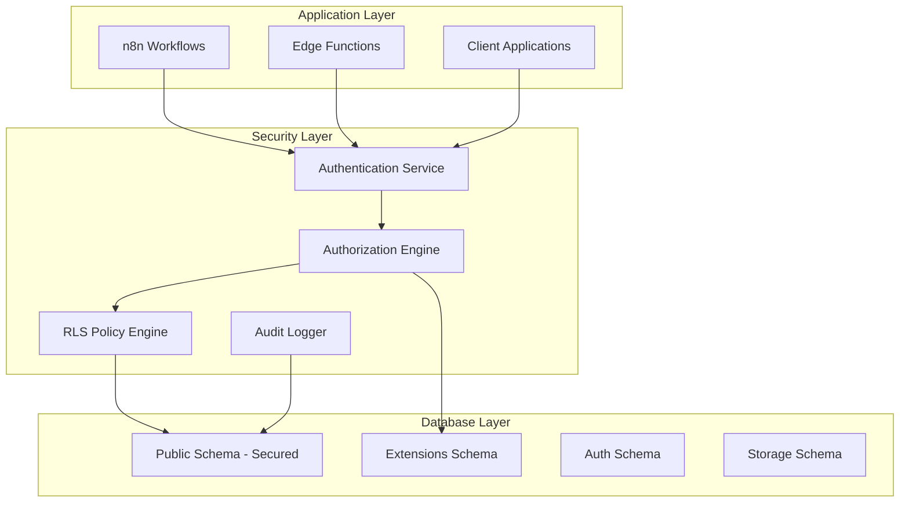
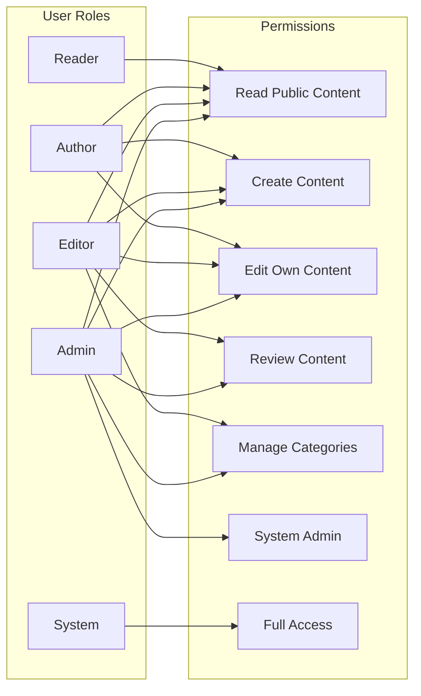

# Security Hardening Design Document

## Overview

This design document outlines the comprehensive security hardening implementation for the Allixios CMS platform. The design addresses critical security vulnerabilities identified in the Supabase database audit while maintaining the platform's high-performance database-first architecture and existing functionality.

The security hardening will be implemented in phases to minimize disruption to existing workflows while ensuring immediate protection of the most sensitive data. The design prioritizes Row Level Security (RLS) implementation, function security hardening, and comprehensive access control systems.

## Architecture

### Security Architecture Overview



### Role-Based Access Control (RBAC) Design



## Components and Interfaces

### 1. Row Level Security (RLS) Policy System

#### Critical Tables RLS Implementation

**Revenue and Financial Data Protection**
```sql
-- Revenue metrics - user/organization isolation
CREATE POLICY "revenue_metrics_isolation" ON revenue_metrics
    FOR ALL USING (
        auth.uid() = user_id OR 
        EXISTS (
            SELECT 1 FROM user_roles ur 
            WHERE ur.user_id = auth.uid() 
            AND ur.role IN ('admin', 'financial_analyst')
        )
    );

-- Performance intelligence cache - role-based access
CREATE POLICY "performance_cache_access" ON performance_intelligence_cache
    FOR SELECT USING (
        is_public = true OR
        EXISTS (
            SELECT 1 FROM user_roles ur 
            WHERE ur.user_id = auth.uid() 
            AND ur.role IN ('admin', 'editor', 'analyst')
        )
    );
```

**N8N Execution Security**
```sql
-- N8N executions - workflow owner access
CREATE POLICY "n8n_execution_owner" ON n8n_executions
    FOR ALL USING (
        created_by = auth.uid() OR
        EXISTS (
            SELECT 1 FROM user_roles ur 
            WHERE ur.user_id = auth.uid() 
            AND ur.role IN ('admin', 'workflow_manager')
        )
    );
```

**Content Management Security**
```sql
-- Articles - content ownership and visibility
CREATE POLICY "articles_access" ON articles
    FOR SELECT USING (
        status = 'published' OR
        author_id = auth.uid() OR
        EXISTS (
            SELECT 1 FROM user_roles ur 
            WHERE ur.user_id = auth.uid() 
            AND ur.role IN ('admin', 'editor')
        )
    );

-- Users - privacy protection
CREATE POLICY "users_privacy" ON users
    FOR ALL USING (
        id = auth.uid() OR
        EXISTS (
            SELECT 1 FROM user_roles ur 
            WHERE ur.user_id = auth.uid() 
            AND ur.role = 'admin'
        )
    );
```

#### RLS Policy Categories

1. **Ownership-Based Policies**: User can only access their own data
2. **Role-Based Policies**: Access based on user role hierarchy
3. **Status-Based Policies**: Access based on content publication status
4. **Organization-Based Policies**: Multi-tenant data isolation
5. **Time-Based Policies**: Access restrictions based on temporal conditions

### 2. Function Security Hardening System

#### Secure Search Path Implementation

```sql
-- Template for secure function creation
CREATE OR REPLACE FUNCTION secure_function_template()
RETURNS jsonb
LANGUAGE plpgsql
SECURITY DEFINER
SET search_path = public, extensions
AS $$
DECLARE
    -- Function variables
BEGIN
    -- Validate caller permissions
    IF NOT EXISTS (
        SELECT 1 FROM user_roles 
        WHERE user_id = auth.uid() 
        AND role IN ('admin', 'authorized_role')
    ) THEN
        RAISE EXCEPTION 'Insufficient permissions';
    END IF;
    
    -- Function logic here
    RETURN jsonb_build_object('success', true);
END;
$$;
```

#### Function Security Categories

1. **Public Functions**: Available to all authenticated users
2. **Role-Restricted Functions**: Require specific role membership
3. **Admin Functions**: Require administrative privileges
4. **System Functions**: Internal use only with service role
5. **Audit Functions**: Special logging and monitoring functions

### 3. Extension Security Architecture

#### Extensions Schema Design

```sql
-- Create dedicated extensions schema
CREATE SCHEMA IF NOT EXISTS extensions;

-- Move existing extensions
ALTER EXTENSION vector SET SCHEMA extensions;
ALTER EXTENSION pg_trgm SET SCHEMA extensions;

-- Grant appropriate permissions
GRANT USAGE ON SCHEMA extensions TO authenticated;
GRANT USAGE ON SCHEMA extensions TO service_role;
```

#### Extension Access Control

```sql
-- Secure extension function wrapper
CREATE OR REPLACE FUNCTION public.secure_vector_search(
    query_vector vector,
    similarity_threshold float DEFAULT 0.8
)
RETURNS TABLE(id uuid, similarity float)
LANGUAGE plpgsql
SECURITY DEFINER
SET search_path = public, extensions
AS $$
BEGIN
    -- Validate user permissions
    IF NOT EXISTS (
        SELECT 1 FROM user_roles 
        WHERE user_id = auth.uid() 
        AND role IN ('admin', 'editor', 'author')
    ) THEN
        RAISE EXCEPTION 'Vector search requires authentication';
    END IF;
    
    -- Execute secure vector search
    RETURN QUERY
    SELECT a.id, (a.embedding <-> query_vector) as similarity
    FROM articles a
    WHERE (a.embedding <-> query_vector) < similarity_threshold
    AND (
        a.status = 'published' OR
        a.author_id = auth.uid() OR
        EXISTS (
            SELECT 1 FROM user_roles ur 
            WHERE ur.user_id = auth.uid() 
            AND ur.role IN ('admin', 'editor')
        )
    )
    ORDER BY similarity;
END;
$$;
```

### 4. Materialized View Security System

#### Secure Materialized View Design

```sql
-- Secure popular articles view
CREATE MATERIALIZED VIEW secure_popular_articles AS
SELECT 
    a.id,
    a.title,
    a.slug,
    a.view_count,
    a.engagement_score,
    a.published_at,
    CASE 
        WHEN a.status = 'published' THEN a.excerpt
        ELSE NULL
    END as excerpt
FROM articles a
WHERE a.status = 'published'
AND a.is_featured = true;

-- Create RLS policy for materialized view
ALTER MATERIALIZED VIEW secure_popular_articles ENABLE ROW LEVEL SECURITY;

CREATE POLICY "popular_articles_public" ON secure_popular_articles
    FOR SELECT USING (true); -- Public read access for published content
```

#### Materialized View Refresh Security

```sql
-- Secure refresh function
CREATE OR REPLACE FUNCTION refresh_secure_materialized_views()
RETURNS void
LANGUAGE plpgsql
SECURITY DEFINER
AS $$
BEGIN
    -- Validate admin permissions
    IF NOT EXISTS (
        SELECT 1 FROM user_roles 
        WHERE user_id = auth.uid() 
        AND role = 'admin'
    ) THEN
        RAISE EXCEPTION 'Only administrators can refresh materialized views';
    END IF;
    
    -- Refresh views
    REFRESH MATERIALIZED VIEW secure_popular_articles;
    REFRESH MATERIALIZED VIEW secure_article_performance;
    
    -- Log the refresh
    INSERT INTO audit_logs (action, table_name, user_id, details)
    VALUES ('materialized_view_refresh', 'system', auth.uid(), 
            jsonb_build_object('timestamp', NOW()));
END;
$$;
```

## Data Models

### Security Tables Schema

```sql
-- User roles table
CREATE TABLE IF NOT EXISTS user_roles (
    id uuid PRIMARY KEY DEFAULT gen_random_uuid(),
    user_id uuid REFERENCES auth.users(id) ON DELETE CASCADE,
    role text NOT NULL CHECK (role IN ('reader', 'author', 'editor', 'admin', 'system')),
    granted_by uuid REFERENCES auth.users(id),
    granted_at timestamptz DEFAULT NOW(),
    expires_at timestamptz,
    is_active boolean DEFAULT true,
    created_at timestamptz DEFAULT NOW(),
    updated_at timestamptz DEFAULT NOW(),
    UNIQUE(user_id, role)
);

-- Audit logs table
CREATE TABLE IF NOT EXISTS audit_logs (
    id uuid PRIMARY KEY DEFAULT gen_random_uuid(),
    action text NOT NULL,
    table_name text NOT NULL,
    record_id uuid,
    user_id uuid REFERENCES auth.users(id),
    ip_address inet,
    user_agent text,
    details jsonb,
    created_at timestamptz DEFAULT NOW()
);

-- Security violations table
CREATE TABLE IF NOT EXISTS security_violations (
    id uuid PRIMARY KEY DEFAULT gen_random_uuid(),
    violation_type text NOT NULL,
    severity text CHECK (severity IN ('low', 'medium', 'high', 'critical')),
    user_id uuid REFERENCES auth.users(id),
    ip_address inet,
    details jsonb,
    resolved boolean DEFAULT false,
    resolved_by uuid REFERENCES auth.users(id),
    resolved_at timestamptz,
    created_at timestamptz DEFAULT NOW()
);

-- Encrypted sensitive data table
CREATE TABLE IF NOT EXISTS encrypted_data (
    id uuid PRIMARY KEY DEFAULT gen_random_uuid(),
    table_name text NOT NULL,
    record_id uuid NOT NULL,
    field_name text NOT NULL,
    encrypted_value text NOT NULL,
    encryption_key_id text NOT NULL,
    created_at timestamptz DEFAULT NOW(),
    updated_at timestamptz DEFAULT NOW(),
    UNIQUE(table_name, record_id, field_name)
);
```

### Security Indexes

```sql
-- Performance indexes for security queries
CREATE INDEX idx_user_roles_user_active ON user_roles(user_id, is_active) WHERE is_active = true;
CREATE INDEX idx_audit_logs_user_time ON audit_logs(user_id, created_at DESC);
CREATE INDEX idx_security_violations_severity ON security_violations(severity, created_at DESC) WHERE resolved = false;
CREATE INDEX idx_encrypted_data_lookup ON encrypted_data(table_name, record_id, field_name);
```

## Error Handling

### Security Error Categories

1. **Authentication Errors**: Invalid or expired credentials
2. **Authorization Errors**: Insufficient permissions for requested action
3. **RLS Policy Violations**: Attempt to access restricted data
4. **Function Security Violations**: Unauthorized function execution
5. **Data Encryption Errors**: Issues with encryption/decryption processes

### Error Handling Strategy

```sql
-- Centralized security error handler
CREATE OR REPLACE FUNCTION handle_security_error(
    error_type text,
    error_message text,
    error_details jsonb DEFAULT '{}'
)
RETURNS void
LANGUAGE plpgsql
SECURITY DEFINER
AS $$
BEGIN
    -- Log security violation
    INSERT INTO security_violations (
        violation_type,
        severity,
        user_id,
        ip_address,
        details
    ) VALUES (
        error_type,
        CASE 
            WHEN error_type IN ('rls_violation', 'unauthorized_access') THEN 'high'
            WHEN error_type IN ('authentication_failure', 'permission_denied') THEN 'medium'
            ELSE 'low'
        END,
        auth.uid(),
        inet_client_addr(),
        error_details || jsonb_build_object('message', error_message, 'timestamp', NOW())
    );
    
    -- Raise appropriate exception
    RAISE EXCEPTION 'Security violation: %', error_message;
END;
$$;
```

## Testing Strategy

### Security Testing Framework

#### 1. RLS Policy Testing

```sql
-- Test framework for RLS policies
CREATE OR REPLACE FUNCTION test_rls_policy(
    table_name text,
    test_user_id uuid,
    test_role text,
    expected_access boolean
)
RETURNS boolean
LANGUAGE plpgsql
AS $$
DECLARE
    test_result boolean;
BEGIN
    -- Set test user context
    PERFORM set_config('request.jwt.claims', 
        jsonb_build_object('sub', test_user_id)::text, true);
    
    -- Insert test role
    INSERT INTO user_roles (user_id, role) 
    VALUES (test_user_id, test_role)
    ON CONFLICT (user_id, role) DO NOTHING;
    
    -- Test access
    EXECUTE format('SELECT EXISTS(SELECT 1 FROM %I LIMIT 1)', table_name) INTO test_result;
    
    -- Cleanup
    DELETE FROM user_roles WHERE user_id = test_user_id AND role = test_role;
    
    RETURN test_result = expected_access;
END;
$$;
```

#### 2. Function Security Testing

```sql
-- Test function security
CREATE OR REPLACE FUNCTION test_function_security(
    function_name text,
    test_user_id uuid,
    test_role text,
    should_succeed boolean
)
RETURNS boolean
LANGUAGE plpgsql
AS $$
DECLARE
    test_passed boolean := false;
BEGIN
    -- Set test context
    PERFORM set_config('request.jwt.claims', 
        jsonb_build_object('sub', test_user_id)::text, true);
    
    -- Insert test role
    INSERT INTO user_roles (user_id, role) 
    VALUES (test_user_id, test_role)
    ON CONFLICT (user_id, role) DO NOTHING;
    
    -- Test function execution
    BEGIN
        EXECUTE format('SELECT %I()', function_name);
        test_passed := should_succeed;
    EXCEPTION
        WHEN insufficient_privilege OR security_definer_search_path THEN
            test_passed := NOT should_succeed;
    END;
    
    -- Cleanup
    DELETE FROM user_roles WHERE user_id = test_user_id AND role = test_role;
    
    RETURN test_passed;
END;
$$;
```

#### 3. Integration Testing

- **End-to-End Security Tests**: Complete user journey security validation
- **Performance Impact Tests**: Ensure security doesn't degrade performance
- **Compliance Tests**: Validate against security standards
- **Penetration Tests**: Simulate attack scenarios

### Testing Phases

1. **Unit Tests**: Individual RLS policies and functions
2. **Integration Tests**: Cross-component security validation
3. **Performance Tests**: Security overhead measurement
4. **User Acceptance Tests**: Role-based access validation
5. **Security Audit Tests**: Comprehensive security review

## Implementation Phases

### Phase 1: Critical Security (Week 1)
- Enable RLS on all 8 unprotected tables
- Implement basic ownership and role-based policies
- Fix function search path issues
- Enable audit logging

### Phase 2: Comprehensive RLS (Week 2)
- Implement policies for all 27 tables with missing policies
- Create role-based access control system
- Implement data encryption for sensitive fields
- Set up security monitoring

### Phase 3: Advanced Security (Week 3)
- Move extensions to dedicated schema
- Secure materialized views
- Implement advanced audit logging
- Create security testing framework

### Phase 4: Monitoring and Compliance (Week 4)
- Set up real-time security monitoring
- Implement compliance reporting
- Create security documentation
- Conduct security audit and testing

This design ensures comprehensive security hardening while maintaining the platform's excellent performance and functionality.